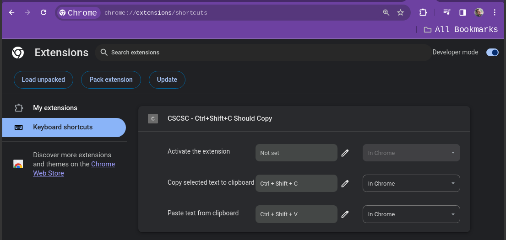

# CSCSC - Ctrl+Shift+C Should Copy  (YF)

---
I'm really tired of getting Dev Tool opened every time I ALT+TAB from terminal
and press CTRL+SHIFT+C.  
I really am.
  
This extension prevents it.  

---

## Installation

1) Using source code:
   2) Download this repo
   3) Access `chrome://extensions`
   4) Turn `Developer mode` on
   5) Click `Load unpacked`
   6) select the `src` folder inside this repo

---

It does not matter how you installed this extension, please consider verifying the shortcuts    
Access `chrome://extensions/shortcuts` and compare

